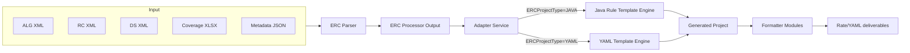

# ERC Parsing Management Platform

Multi-module Spring Boot workspace that parses carrier rating content (ALG/DS/RC XML + spreadsheets) and generates executable rule/templating projects in either Java or YAML form. The aggregator POM `erc-parsing-management` ties together 7 deployable modules built with Maven and Java 8.

## Module Map & Entry Points

| Module | Responsibility | Entry point | Downstream dependencies |
| --- | --- | --- | --- |
| `erc-domain` | Shared domain model for ALG parsing, ERC metadata, and build contracts (`ERCProjectBuildService`, `ERCProcessorOutput`, enums). | [erc-domain/src/main/java/com/nest/erc/domain/ErcParsingManagementObjectModelApplication.java](erc-domain/src/main/java/com/nest/erc/domain/ErcParsingManagementObjectModelApplication.java) | Spring Boot Web, Log4j 1.2, exported JAR consumed everywhere. |
| `erc-parser` | CLI-style orchestrator that ingests XML/JSON inputs, builds the in-memory `ERCProcessorOutput`, and calls the adapter to create deliverables. | [erc-parser/src/main/java/com/nest/erc/parser/ERCParser.java](erc-parser/src/main/java/com/nest/erc/parser/ERCParser.java) | Depends on `erc-domain`, `erc-adapter`, Apache POI, Commons Lang/Text, Log4j. |
| `erc-adapter` | Gateway that decides whether to build Java or YAML artifacts based on `ERCProjectType` and delegates to the proper engine. | [erc-adapter/src/main/java/com/nest/erc/adapter/gateway/ErcAdapterGatewayApplication.java](erc-adapter/src/main/java/com/nest/erc/adapter/gateway/ErcAdapterGatewayApplication.java) | Uses `erc-domain`, `erc-javarule-template-engine`, `erc-yaml-template-engine`. |
| `erc-javarule-template-engine` | Generates Spring Boot microservice scaffolding, POJOs, rule classes, and supporting files via Freemarker templates. | [erc-javarule-template-engine/src/main/java/com/nest/erc/java/template/engine/ErcAdapterTemplateEngineApplication.java](erc-javarule-template-engine/src/main/java/com/nest/erc/java/template/engine/ErcAdapterTemplateEngineApplication.java) | Freemarker, Commons Lang, `erc-domain`. |
| `erc-yaml-template-engine` | Builds YAML representations of products and rate tables, coordinating YAML formatting and persistence. | [erc-yaml-template-engine/src/main/java/com/nest/erc/yaml/engine/ErcYAMLTemplateEngine.java](erc-yaml-template-engine/src/main/java/com/nest/erc/yaml/engine/ErcYAMLTemplateEngine.java) | Depends on `erc-domain`, `erc-yaml-formatter`. |
| `erc-yaml-formatter-snakeyaml` | Thin wrapper around SnakeYAML with formatter helpers used in tests and downstream formatters. | [erc-yaml-formatter-snakeyaml/src/main/java/com/nest/erc/yaml/formatter/snakeyaml/ErcYamlFormatterSnakeyamlApplication.java](erc-yaml-formatter-snakeyaml/src/main/java/com/nest/erc/yaml/formatter/snakeyaml/ErcYamlFormatterSnakeyamlApplication.java) | Provides Spring Boot context for formatter utilities. |
| `erc-yaml-formatter` | Applies formatting/polishing steps (ordering, schema tagging) before YAML files are emitted. | [erc-yaml-formatter/src/main/java/com/nest/erc/yaml/formatter/ErcYamlFormatterApplication.java](erc-yaml-formatter/src/main/java/com/nest/erc/yaml/formatter/ErcYamlFormatterApplication.java) | Pulls in `erc-yaml-formatter-snakeyaml`. |

## End-to-End Flow



1. `erc-parser` scans `parserproject.inputFilelocation` for ALG/RC/DS XML and coverage spreadsheets, parses them via specialized services (`ALGXMLParserService`, `DSXmlParserService`, `RCXmlRelationSetter`).
2. `ERCProcessorServiceImpl` walks the ALG AST, extracts POJO structures, merges RC rate tables, and enriches metadata into `ERCProcessorOutput`.
3. `AdapterService` chooses the generator (`ERCProjectType.JAVA` vs `ERCProjectType.YAML`) and delegates to `JavaRuleGatewayServiceImpl` or `YamlGatewayServiceImpl`.
4. The chosen engine builds project scaffolding (Spring Boot app or YAML bundle), emits artifacts into the configured container folders, and optionally calls YAML formatter utilities before writing to disk.

## Build & Run

### Prerequisites
- Java 8 (per-module `java.version` targets 1.8)
- Maven 3.6+ (use project-provided `mvnw*` scripts for reproducibility)
- Adequate file permissions for `erc-parser/input` and `erc-parser/output`

### Build every module

```
./mvnw clean install
```

### Run the parser pipeline end-to-end

```
./mvnw -pl erc-parser spring-boot:run \
  -Dspring-boot.run.arguments="--parserproject.inputFilelocation=C:/data/input \
    --parserproject.containerlocation=C:/tmp/generated \
    --parserproject.projectType=JAVA"
```

The parser exits with status `0` after generating projects or `1` on fatal errors (`System.exit(1)` inside [ERCParser](erc-parser/src/main/java/com/nest/erc/parser/ERCParser.java)).

### Generate artifacts only
- Java scaffolding: invoke `JavaRuleGatewayServiceImpl.buildJavaProject` through the adapter by setting `parserproject.projectType=JAVA`.
- YAML bundles: set `parserproject.projectType=YAML`; `YamlGatewayServiceImpl` will emit `product.yaml` (and siblings) under `parserproject.containerlocation`.

### Run individual modules (useful for development)

```
./mvnw -pl erc-domain spring-boot:run
./mvnw -pl erc-adapter spring-boot:run
./mvnw -pl erc-javarule-template-engine spring-boot:run
```

Each module is a Spring Boot app with its own `main` class, enabling isolated debugging.

## Configuration

The parser and template engines share the `parserproject.*` namespace, bound to `ERCParserProjectProperties` and `ProjectYamlProperties`.

| Property | Description |
| --- | --- |
| `parserproject.inputFilelocation` | Folder that holds ALG/RC/DS XMLs and supporting JSON (default sample: `erc-parser/input`). |
| `parserproject.containerlocation` | Output root for generated projects (Java microservices or YAML packages). |
| `parserproject.projectType` | `JAVA` or `YAML`, controls which generator the adapter uses. |
| `parserproject.dsFileNameStartCharacter`, `parserproject.algFileNameStartCharcter`, `parserproject.rcFileNameStartCharcter` | Prefix markers that let the parser categorize files per state. |
| `parserproject.rateTableFileLocation` | Destination for rate-table JSONs emitted by `RateTableLookupCreator`. |
| `parserproject.coverageAvailabiltyFileName` | Points to the Excel workbook consumed by `ALGAvailableCoverageXMLParser`. |
| `parserproject.commonConfigFile` | Path to JSON loaded into `CommonConfig` for downstream generators. |
| `parserproject.lobName`, `parserproject.version` | Used for package naming, Jenkins pipeline generation, and `ErcPackageDetails.json` updates. |

> Tip: because `application.properties` in `erc-parser` is empty, pass overrides via command-line arguments, environment variables, or a custom profile-specific properties file.

## Data & Directory Layout

- `erc-parser/input` holds sample inputs: ALG/RC/DS XMLs plus JSON metadata (`CommonConfig.json`, `ErcPackageDetails.json`).
- `erc-parser/output` contains generated inspection artifacts (rate-table JSON, YAML drafts, metadata snapshots, and subfolders like `rate_tables/` or `resBOP_AL_09012019/`).
- Template engines respect `parserproject.containerlocation`, generating per-state subfolders for each LOB and version. Rate table lookups also land under `${project.build.directory}/lib` via the Maven dependency plugin configuration in [erc-parser/pom.xml](erc-parser/pom.xml).

## Key Java Components

- Parsing: [ERCParser](erc-parser/src/main/java/com/nest/erc/parser/ERCParser.java) wires `ALGXMLParserService`, `DSXmlParserService`, `RCXmlRelationSetter`, and `ALGAvailableCoverageXMLParser` to build `ERCProcessorOutput`.
- Processing: [ERCProcessorServiceImpl](erc-parser/src/main/java/com/nest/erc/parser/ERCProcessorServiceImpl.java) traverses ALG references (`IF/ELSE`, `Loop`, `Assign`) to produce POJO definitions and DS variable typing.
- Adapter: [MainGatewayService](erc-adapter/src/main/java/com/nest/erc/adapter/service/MainGatewayService.java) selects Java vs YAML builders using `ERCProjectType` and delegates to `ERCProjectBuildService` implementations.
- Java generation: [JavaRuleGatewayServiceImpl](erc-javarule-template-engine/src/main/java/com/nest/erc/java/template/engine/services/JavaRuleGatewayServiceImpl.java) calls `JavaERCProjectService` to create packages, rule classes, Jenkinsfile, and rate lookup scaffolding.
- YAML generation: [YamlGatewayServiceImpl](erc-yaml-template-engine/src/main/java/com/nest/erc/yaml/service/YamlGatewayServiceImpl.java) produces lists of `YAMLObject` instances and serializes each via `YamlService`.

## Dependency Highlights

- Spring Boot 2.2.4 (parent) with starter modules (web, freemarker, test).
- Log4j 1.2.17 (legacy logging used in parser and domain).
- Apache POI 4.1.2 for spreadsheet parsing and YAML engine 3.9 for some historical components.
- Apache Commons Lang/Text, Jackson Databind, Gson, JSON-simple for utility parsing.
- SnakeYAML is intentionally excluded from the template engine and reintroduced via `erc-yaml-formatter-snakeyaml` to control versioning.

## Testing & Quality

- Run `./mvnw test` (or `./mvnw -pl module test`) to execute module-specific Spring Boot tests.
- Template-heavy modules rely on Freemarker unit tests; YAML formatter modules include SnakeYAML-driven verifications under `src/test/java`.
- Consider adding integration data sets in `erc-parser/input` and asserting expected artifacts inside `erc-parser/output` for regression safety.

## Troubleshooting

- **Missing input files**: `ERCParser` silently skips unknown prefixes; ensure `parserproject.*FileNameStart*` properties align with file names.
- **Rate table mismatches**: `RateTableLookupCreator` writes JSON files under `parserproject.rateTableFileLocation`; inspect them to validate RC merges.
- **Null DS types**: `ERCProcessorServiceImpl.setDSVariableType` populates DS variable metadata from `DSWrapper`; confirm DS XML conforms to the expected schema.
- **YAML formatting**: If generated YAML lacks schema metadata, run the formatter module directly to normalize indentation or anchors.

---

Need a quick orientation? Start by copying fresh ALG/RC/DS XMLs into `erc-parser/input`, review `parserproject` properties, then run `erc-parser`. The adapter will take care of choosing the right generator and writing deliverables to your configured container.
